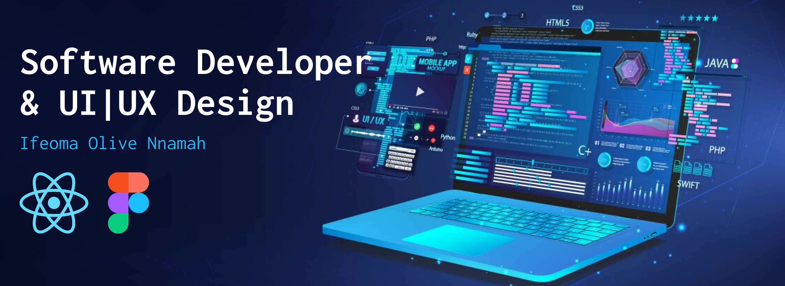

<h1 align="center">Hi 👋, I'm Ifeoma</h1>

<h3 align="center">Let’s transform your vision into reality with precision and creativity. Reach out today, and let’s build something extraordinary!</h3>

  

- 👨‍💻 All of my projects are available at [https://ifeoma-nnamah.netlify.app/](https://ifeoma-nnamah.netlify.app/)

- 📫 How to reach me **ifeomannamah@gmail.com**

- 📄 Know about my experiences [https://ifeoma-nnamah.netlify.app/](https://ifeoma-nnamah.netlify.app/)

<h3 align="left">Connect with me:</h3>

<h3 align="left">Organisations:</h3>

  
  &nbsp;&nbsp;&nbsp;
  

<h3 align="left">Languages and Tools:</h3>

        

<h3 align="left">Github Stats:</h3>

&nbsp;

